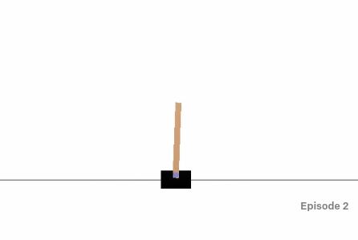
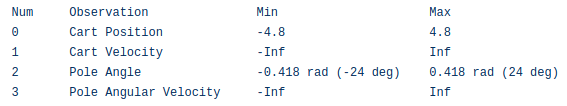
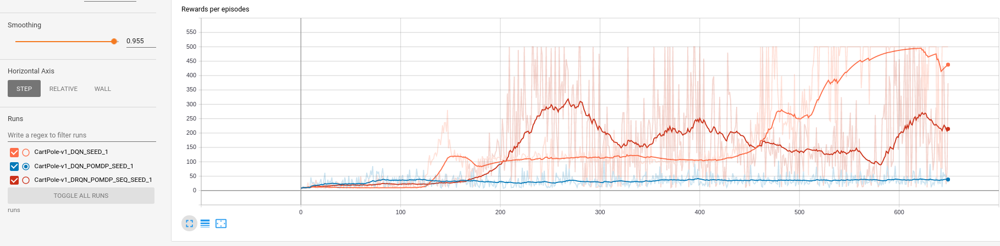

# Deep Recurrent Q-Learning (DRQN) with Pytorch

This repository is dedicated to implementing Deep Recurrent Q-Learning (DRQN) using PyTorch, inspired by the paper [Deep Recurrent Q-Learning for Partially Observable MDPs](https://arxiv.org/pdf/1507.06527.pdf).

## Prerequisites

To get started with this project, ensure you have the following installed:
- Pytorch (version 1.5.0)
- OpenAI Gym (version 0.17.1)
- Tensorboard (version 2.1.0)

## Training Environment

We utilize the OpenAI Gym's `CartPole-v1` environment for training our DRQN model.

---

## Partially Observable Markov Decision Process (POMDP)

In the `CartPole-v1` environment, the agent receives information about the cart's position, velocity, and the pole's angle, velocity. For our DRQN implementation, we define the observable state as the position of the cart and the angle of the pole, deliberately omitting velocity data to create a POMDP.

---

## Stable Recurrent Updates

We employ two methods for stable recurrent updates in our DRQN model:

### 1. Bootstrapped Sequential Updates
- Randomly select episodes from the replay memory.
- Start updating from the **beginning** of each episode.
- Generate targets at each timestep from the target Q-network.
- Carry forward the RNN's hidden state throughout the episode.

### 2. Bootstrapped Random Update
- Randomly select episodes from the replay memory.
- Begin updating from **random points** within the episode for a predetermined number of timesteps (`lookup_step`).
- Zero out the RNN's initial state at the start of each update.
- Again, targets at each timestep are generated from the target Q-network.

The parameters above are crucial for configuring the DRQN settings, including the choice of update method and the length of the `lookup_step`. Longer `lookup_step` values have shown to yield better results.

---

## Comparative Analysis: DQN vs. DRQN

We compare three scenarios:
- DQN with a fully observed MDP.
- DQN under POMDP conditions.
- DRQN under POMDP conditions.

Observations:
- DQN with full observability (orange) achieves the highest rewards.
- DQN under POMDP constraints (blue) struggles to reach high rewards.
- DRQN in POMDP scenarios (red) demonstrates decent performance, despite limited observability.

---

## TODO

- [x] Implement random update mechanism in DRQN.

---

Feel free to contribute or suggest improvements to this project!

